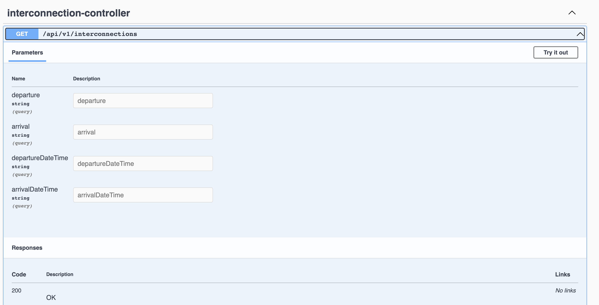

# interconnecting-flights-ryanair
The goal of this project is to get possible direct/1 stop flights from one location to another.

This is the first version and still will need some improvements. One of them it's dealing with the behaviour when the flight arrives on the next day.
Other is improve visualization when there're multiple options for the flight. Also, integration tests can be added to improve test coverage and guarantee the right behaviours.

## Installation

This was made using Java 17 and Maven.

Having this installed, you need to run:

```bash
mvn clean install
```

## Usage

To run the app on port 8080:
```bash
java -jar target/interconnecting-flights-ryanair-0.0.1.jar 
```

Or, you can run it on Docker. First build the image:
```bash
docker build -t interconnecting-flights-ryanair .
```

Than run it:
```bash
docker run -p 8080:8080 interconnecting-flights-ryanair
```

## Open API
You can check the endpoints inputs and outputs on the [Swagger page](http://localhost:8080/swagger-ui/index.html)


## Contributing
Pull requests are welcome. For major changes, please open an issue first to discuss what you would like to change.

Please make sure to update tests as appropriate.

## License
[MIT](https://choosealicense.com/licenses/mit/)